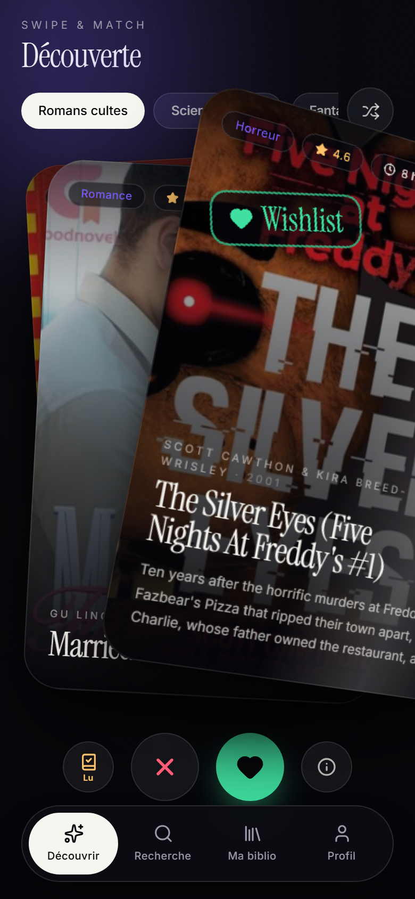
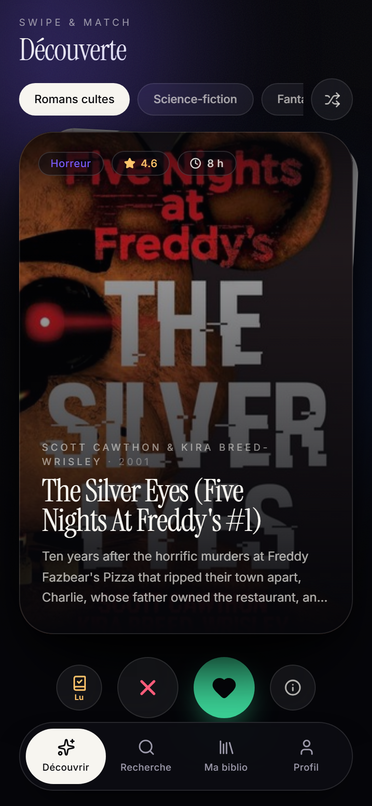
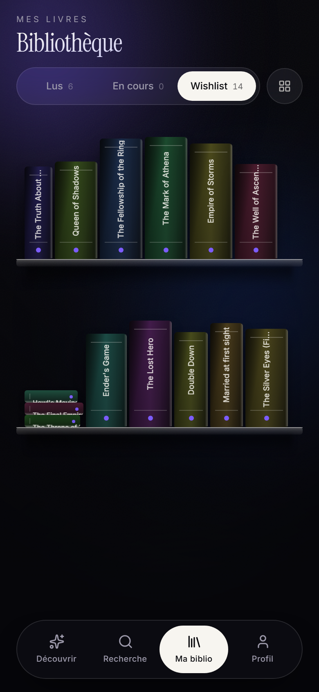
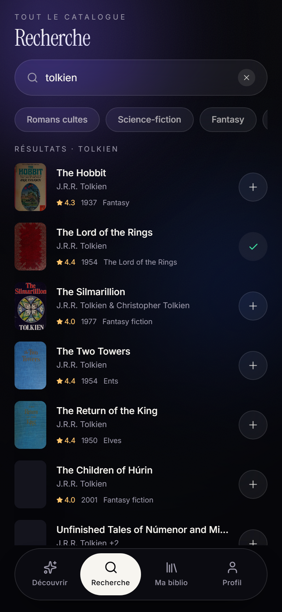
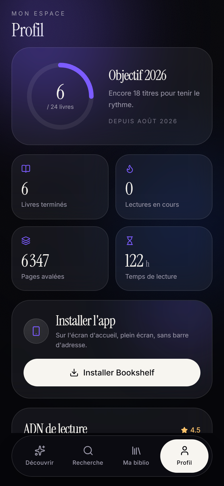
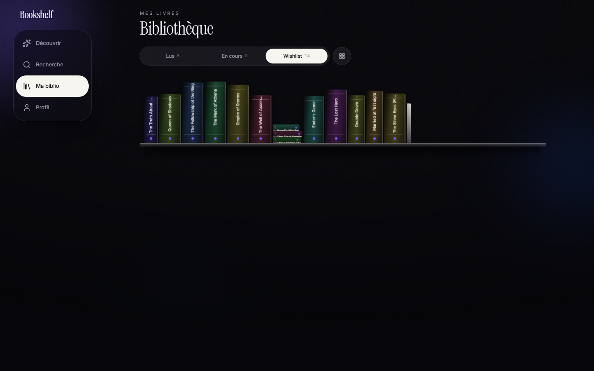

<div align="center">


# Bookshelf

**Swipe. Découvre. Range.**
Ta bibliothèque personnelle, animée au doigt.


</div>

---

<div align="center">



**À droite pour garder, à gauche pour passer.**
La carte s'incline en 3D sous le doigt, le tampon se révèle à mesure du geste,
et la pile derrière avance en même temps.

</div>

---

## Quatre écrans

<div align="center">
<table>
<tr>
<td align="center" width="25%"></td>
<td align="center" width="25%"></td>
<td align="center" width="25%"></td>
<td align="center" width="25%"></td>
</tr>
<tr>
<td align="center"><b>Découvrir</b><br/><sub>un deck sans fin</sub></td>
<td align="center"><b>Ma biblio</b><br/><sub>de vrais dos de livres</sub></td>
<td align="center"><b>Rechercher</b><br/><sub>tout le catalogue</sub></td>
<td align="center"><b>Profil</b><br/><sub>tes statistiques</sub></td>
</tr>
</table>
</div>

---

## Ce qui rend l'app particulière

🎴 **Un deck qui répond au doigt près**
Rotation, bascule 3D, parallaxe de la couverture, reflet spéculaire et promotion
progressive de la carte suivante — le tout piloté image par image pendant le geste.
Distance **ou** vélocité décident : un flick court mais vif suffit.

📚 **Une étagère, pas une grille**
Tes livres sont rangés debout, vus de dos. L'épaisseur d'une tranche suit sa
pagination — un pavé est visiblement plus large qu'une novella — et quelques piles
couchées cassent la ligne. Les livres émergent de la planche quand la vue s'ouvre.

🔍 **Le catalogue Open Library**
Recherche plein texte instantanée, douze étagères thématiques, synopsis chargés à
la demande, couvertures HD. Aucune clé d'API, aucun quota. Le mode hors-ligne prend
le relais tout seul.

✨ **Tout est animé avec GSAP**
Pas une transition CSS : `Draggable`, `InertiaPlugin` et des timelines sur mesure,
avec un nettoyage rigoureux des contextes via `useGSAP`.

📱 **Installable comme une vraie app**
Service worker maison, manifeste complet, icônes générées par script. Sur Android,
Chrome en fait un **WebAPK signé** — sans passer par le Play Store.

---

## Sur grand écran

<div align="center">

</div>

Mobile-first, puis deux ruptures : la barre flottante devient un **rail vertical**
en tablette, qui déploie ses libellés en desktop. Le contenu s'élargit, les grilles
gagnent des colonnes — mais le deck reste plafonné et centré : une carte de swipe
large de 900 px n'aurait aucun sens.

---

## Démarrer

```bash
npm install
npm run dev
```

L'URL « Network » affichée au démarrage permet d'ouvrir l'app sur un vrai téléphone
du même Wi-Fi — indispensable pour juger les gestes.

<details>
<summary>Autres commandes</summary>

```bash
npm run build      # tsc --noEmit && vite build
npm run preview    # sert le build : nécessaire pour tester le service worker
npm run typecheck
npm run lint
npm run icons      # régénère les icônes PWA
```

</details>

---

## Sous le capot

| | |
| --- | --- |
| **Interface** | React 19 · TypeScript strict · Tailwind CSS 4 (config CSS-first) |
| **Animation** | GSAP 3.15 + `@gsap/react` — `Draggable`, `InertiaPlugin` |
| **État** | Zustand 5 + `persist` (localStorage) |
| **Données** | Open Library — sans clé, sans quota |
| **Build** | Vite 8 (rolldown) · React Compiler |

📐 **[Architecture](docs/ARCHITECTURE.md)** — comment le système de swipe est bâti,
le rangement en rayons, la gestion des contextes GSAP, les choix de performance.

🧭 **[Passation](aicontext/HANDOFF.md)** — les décisions, les pièges déjà payés et
la méthode de vérification. À lire en premier si tu reprends le projet.

---

<div align="center">
<sub>Interface en français · Dark mode uniquement · Aucun compte, aucune donnée envoyée</sub>
</div>
